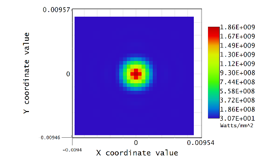
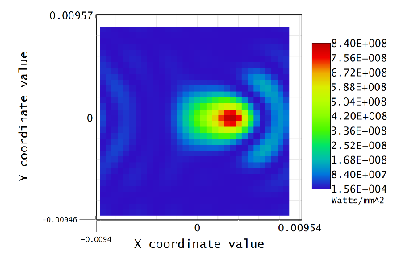

# Basic Newtonian Telescope – Diffraction-Limited Baseline  
*Ansys Zemax OpticStudio Sequential Mode*  

---

## System Overview  

| Parameter | Value |
|-----------|-------|
| Wavelength | 0.55 µm (primary), F, C |
| Entrance Pupil Diameter | 300 mm |
| Fields | 1. 0° (on-axis)   2. 0.1° (off-axis) |

---

## Lens Data Editor (LDE)  

| Surf | Type | Comment | Radius (mm) | Thickness (mm) | Glass | Semi-Diameter (mm) | Other |
|------|------|---------|-------------|----------------|-------|--------------------|---|
| 0 | Standard | Object | Infinity | Infinity | | 0 | |
| 1 | Standard | Dummy air | Infinity | 100 | AIR | 150 | |
| 2 | Standard (Conic = -1) | Primary Parabolic Mirror | –2000 | –600 | MIRROR | 150 | Circular Aperture (max radius 150mm)|
| 3 | Standard | Secondary (flat) | Infinity | 400 | MIRROR | 50 | |
| 4 | Standard | Image | Infinity | 0 | | 10 | |

---

## Expected Performance (Geometric)  

* **On-axis**: All rays collapse to a single point (paraxial focus).  
* **Off-axis (0.1°)**: Classic **coma** flare (Newtonian aberration).  

  
*On-axis (left) and 0.1° off-axis (right). Scale ±400 µm.*

---

## Diffraction PSF - Physical Optics Propagation (POP)

| Field | Peak Irradiance (W/mm^2)|
|-------|-----------------|
| 0° | 1.86 × 10^9 |
| 0.1° | 8.4 × 10^8 |

### On-Axis PSF  
  

### Off-Axis PSF (0.1°)  
  

---

## Files in this Repo  

| File | Description |
|------|-------------|
| `Newtonian_Baseline.zmx` | Full OpticStudio file (before turbulence) |
| `Uncorrected-Baseline.png` | Geometric spot diagram |
| `PSF-OnAxis-Diffraction.png` | POP irradiance map – on-axis |
| `PSF-OffAxis-Diffraction.png` | POP irradiance map – 0.1° |
| `NewtonianScope.md` | This file |

---

## Next Steps (Planned)  

1. **Add atmospheric turbulence** → Zernike Standard Phase surface (defocus, astigmatism, coma).  
2. **Insert deformable mirror** → Zernike Standard Sag on secondary.  
3. **Optimize** DM coefficients → restore diffraction-limited performance.  
4. **Compare** before/after via spot diagrams, PSF, and Strehl ratio.

---

*Built with Ansys Zemax OpticStudio – sequential mode.*  
*Feel free to open `Newtonian_Baseline.zmx` and explore!*