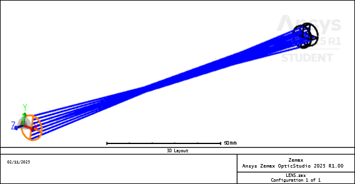
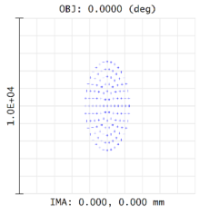

# Toroidal Lens – Basic Ray Tracing & Astigmatism Analysis  
*Ansys Zemax OpticStudio | Sequential Mode*
---

Just like we can take 'conic sections' of a cone, and get circles, ellipses, parabolas, and hyperbolas, we can take 'toric sections' of a torus. They are used to correct for astigmatism. In astrophysical observation, toroidal surfaces are used to correct field astigmatism in wide-field telescope correctors and spectrographs.

## 1. System Overview (Lens Data Editor)

| Surf | Type       | Radius (mm) | Thickness (mm) | Glass  | Semi-Diameter | Conic | Param 1 (X-Radius (mm)) |
|------|------------|-------------|----------------|--------|---------------|-------|--------------------|
| OBJ  | Standard   | Infinity    | Infinity       |        |               |       |                    |
| 1    | Toroidal   | 50.0        | 5.0            | N-BK7  | (auto)        | 0     | 100.0              |
| 2    | Standard   | Infinity    | 200.0          |        | (auto)        | 0     |                    |
| IMA  | Standard   | —           | —              |        |               |       |                    |

- Toroidal surface: Y-radius = 50 mm, X-radius = 100 mm (via Param 1). Y-Z plane focuses sooner.
- Surface 2 is the back (exit) face — required for real lens. If we did not include this surface, we are saying that the light never exits the glass.
- System: on-axis field, 0.55 μm wavelength, 10 mm entrance pupil

---
## 2. 3D Layout

## 3. Spot Diagrams

In ray tracing, Px rays (sampled across the X-direction of the pupil) travel in the Y-Z plane. Py rays (sampled across the Y-direction of the pupil) travel in the X-Z plane.
On the image sensor, the X-coordinate of a spot comes from Px rays — which were bent by the Y-Z curvature.
The Y-coordinate of a spot comes from Py rays — which were bent by the X-Z curvature.
Therefore:
 - RMS X Size = spread in the X-spot coordinate = spread caused by Y-Z focusing.
 - RMS Y Size = spread in the Y-spot coordinate = spread caused by X-Z focusing.

| Direction | Shift | Current Image Plane | Best Focus Position |
|-----------|-------|---------------------|---------------------|
|Y-Focus (Tangential)| –10.436 mm| 200 mm |200 – 10.436 = 189.564 mm |
|X-Focus (Sagittal)| –106.864 mm|200 mm|200 – 106.864 = 93.136 mm |

At the Y-focus (early focus from the tight 50 mm curve), the Y-Z rays are sharp, so spots barely move in X → RMS X Size is tiny.
But X-Z rays are defocused, so spots spread wildly in Y → RMS Y Size is huge.
### Spot Diagrams at Exact Astigmatic Foci

### RMS Spot Sizes at Three Astigmatic Focus Planes  
*(On-axis field, 0.55 µm, 10 mm entrance pupil)*

| Image Plane Thickness  | RMS Spot X Size (µm)| RMS Spot Y Size  |
|------------------------|---------------------|------------------|
| **X-Focus** 93.1 mm    | 1.344E+03           | 4.276E+00        |
| **Mid-Focus** 141.4 mm | 6.706E+02           | 1.354E+03        |
| **Y-Focus** 189.6 mm   | 2.405E+00           | 2.703E+03        |

| **X-Focus** (93.1 mm) | **Mid-Focus** (141.4 mm) | **Y-Focus** (189.6 mm) |
|------------------------|---------------------------|-------------------------|
|  |  |  |

## 3. Optical Path Difference (OPD) Diagrams
Changing the thickness back to 200 mm, the Y-Z plane is nearly focused, but the X-Z plane is strongly defocused — producing a vertical line focus and the deep Py OPD curve below.
 
